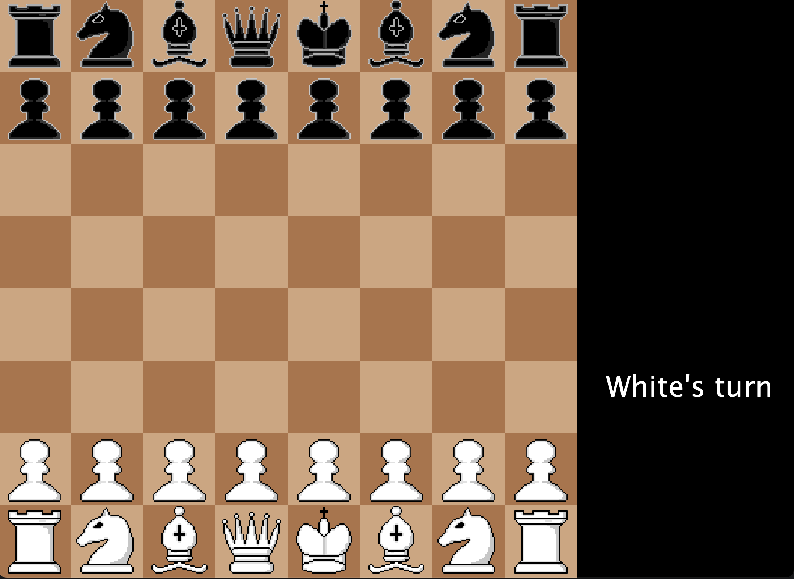

<p align="center">
  
</p>

<h1 align="center">Java Chess Game</h1>

<p align="center">
  <a href="https://github.com/AliAbualsoud/Simple-Chess">https://github.com/AliAbualsoud/Simple-Chess</a>
</p>

<p align="center">
  <strong>A simple chess game written in Java to learn and practice programming skills</strong>
</p>

<p align="center">
  <a href="#about">About</a> •
  <a href="#key-features">Key Features</a> •
  <a href="#getting-started">Getting Started</a> •
  <a href="#gameplay">Gameplay</a> •
  <a href="#tech-stack">Tech Stack</a> •
  <a href="#contributing">Contributing</a> •
  <a href="#license">License</a> •
  <a href="#contact">Contact</a>
</p>

---

## About

The Java Chess Game is a simple, console-based chess game developed as a learning project. It aims to help understand Java basics, Object-Oriented Programming concepts, and game logic. You can play the game against a friend locally, making it a fun way to practice both chess and Java.

## Key Features

♟️ **Standard Chess Rules**: Play a classic game of chess following all the standard rules.<br>
🤖 **Two-Player Mode**: Challenge a friend to a game on the same machine.<br>
💡 **Learning Opportunity**: The project is designed to be simple yet educational for Java beginners.<br>
🕹️ **Command-Line Interface**: Simple text-based interface to move pieces and play the game.

## Getting Started

### Prerequisites

To play the game, ensure you have the following installed:

- Java JDK 11 or later

### Installation

1. Clone the repository to your local machine:

```bash
   git clone https://github.com/YourUsername/JavaChessGame.git
   cd JavaChessGame
   
```

2. Compile the Java files:

```bash
   javac -d bin -sourcepath src src/main/Main.java
   
```

3. Run the game:

```bash
   java -cp bin main.Main
   
```

## Gameplay

Once the game starts, players will be prompted to enter their moves in standard chess notation.

- **Commands**: Use standard chess notation like "e2 e4" to move a piece from one square to another.
- **Objective**: Capture the opponent's king to win the game.
- **Rules**: All standard chess rules apply, including castling, en passant, and pawn promotion.

Here are a few screenshots to give you a sense of the game:

<p align="center">
  
</p>

<p align="center">
  
</p>

## Tech Stack

<p align="center">
  
</p>

This project is entirely written in **Java**, and is aimed at learning foundational programming skills and practicing Object-Oriented Programming.

## Contributing

Contributions are welcome! If you would like to help improve the game, please follow these steps:

1. Fork the project.
2. Create a new branch (`git checkout -b feature/AmazingFeature`).
3. Commit your changes (`git commit -m 'Add some amazing feature'`).
4. Push to the branch (`git push origin feature/AmazingFeature`).
5. Open a Pull Request.

## License

This project is licensed under the MIT License - see the [LICENSE](LICENSE) file for details.

## Contact

If you have any questions or suggestions, feel free to contact me:

- **Ali Abualsoud** - [LinkedIn](https://linkedin.com/in/YourProfile) - [Email](mailto:your.email@example.com)

<p align="center">
  <strong>Enjoy the game and happy coding!</strong>
</p>

<p align="center">
  
  <br>
  <a href="https://youtu.be/your-game-video-link">Watch the Gameplay Video</a>
</p>